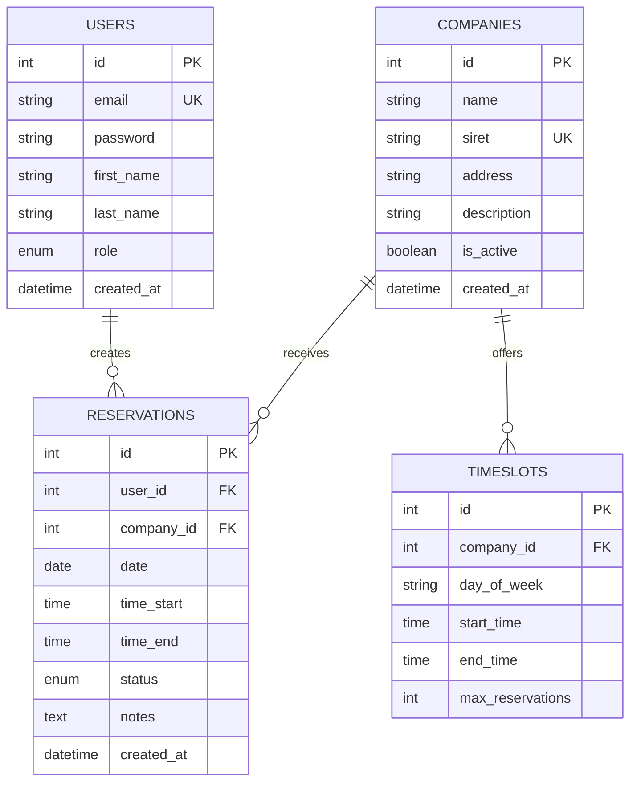

# Base de données

## Vue d'ensemble

La base de données **MySQL 8.0** stocke toutes les données du système de réservation.

## Configuration Docker

Le fichier `Backend/db/docker-compose.yml` configure MySQL :

```yaml
version: '3.8'

services:
  mysql:
    image: mysql:8.0
    restart: always
    environment:
      MYSQL_ROOT_PASSWORD: root_password
      MYSQL_DATABASE: reservations_db
      MYSQL_USER: reserv_user
      MYSQL_PASSWORD: reserv_password
    ports:
      - "3306:3306"
    volumes:
      - mysql_data:/var/lib/mysql

volumes:
  mysql_data:
```

## Schéma de la base

###  Diagramme ERD



## Tables

### users

```sql
CREATE TABLE users (
    id INT AUTO_INCREMENT PRIMARY KEY,
    email VARCHAR(255) NOT NULL UNIQUE,
    password VARCHAR(255) NOT NULL,
    first_name VARCHAR(100) NOT NULL,
    last_name VARCHAR(100) NOT NULL,
    phone VARCHAR(20),
    role ENUM('student', 'company', 'admin') NOT NULL,
    school VARCHAR(255),
    is_active BOOLEAN DEFAULT TRUE,
    email_verified BOOLEAN DEFAULT FALSE,
    created_at TIMESTAMP DEFAULT CURRENT_TIMESTAMP,
    updated_at TIMESTAMP DEFAULT CURRENT_TIMESTAMP ON UPDATE CURRENT_TIMESTAMP,

    INDEX idx_email (email),
    INDEX idx_role (role)
) ENGINE=InnoDB DEFAULT CHARSET=utf8mb4 COLLATE=utf8mb4_unicode_ci;
```

### companies

```sql
CREATE TABLE companies (
    id INT AUTO_INCREMENT PRIMARY KEY,
    name VARCHAR(255) NOT NULL,
    siret VARCHAR(14) UNIQUE,
    address TEXT,
    city VARCHAR(100),
    postal_code VARCHAR(10),
    phone VARCHAR(20),
    email VARCHAR(255),
    website VARCHAR(255),
    sector VARCHAR(100),
    description TEXT,
    logo_url VARCHAR(255),
    is_active BOOLEAN DEFAULT TRUE,
    user_id INT,
    created_at TIMESTAMP DEFAULT CURRENT_TIMESTAMP,
    updated_at TIMESTAMP DEFAULT CURRENT_TIMESTAMP ON UPDATE CURRENT_TIMESTAMP,

    FOREIGN KEY (user_id) REFERENCES users(id) ON DELETE SET NULL,
    INDEX idx_name (name),
    INDEX idx_city (city),
    INDEX idx_active (is_active)
) ENGINE=InnoDB DEFAULT CHARSET=utf8mb4 COLLATE=utf8mb4_unicode_ci;
```

### reservations

```sql
CREATE TABLE reservations (
    id INT AUTO_INCREMENT PRIMARY KEY,
    user_id INT NOT NULL,
    company_id INT NOT NULL,
    date DATE NOT NULL,
    time_start TIME NOT NULL,
    time_end TIME NOT NULL,
    status ENUM('pending', 'confirmed', 'cancelled', 'completed') DEFAULT 'pending',
    notes TEXT,
    cancellation_reason TEXT,
    confirmed_at DATETIME,
    cancelled_at DATETIME,
    created_at TIMESTAMP DEFAULT CURRENT_TIMESTAMP,
    updated_at TIMESTAMP DEFAULT CURRENT_TIMESTAMP ON UPDATE CURRENT_TIMESTAMP,

    FOREIGN KEY (user_id) REFERENCES users(id) ON DELETE CASCADE,
    FOREIGN KEY (company_id) REFERENCES companies(id) ON DELETE CASCADE,

    INDEX idx_user (user_id),
    INDEX idx_company (company_id),
    INDEX idx_date (date),
    INDEX idx_status (status),
    UNIQUE KEY unique_reservation (company_id, date, time_start)
) ENGINE=InnoDB DEFAULT CHARSET=utf8mb4 COLLATE=utf8mb4_unicode_ci;
```

### timeslots

```sql
CREATE TABLE timeslots (
    id INT AUTO_INCREMENT PRIMARY KEY,
    company_id INT NOT NULL,
    day_of_week ENUM('monday', 'tuesday', 'wednesday', 'thursday', 'friday', 'saturday', 'sunday'),
    start_time TIME NOT NULL,
    end_time TIME NOT NULL,
    max_reservations INT DEFAULT 1,
    is_active BOOLEAN DEFAULT TRUE,
    created_at TIMESTAMP DEFAULT CURRENT_TIMESTAMP,

    FOREIGN KEY (company_id) REFERENCES companies(id) ON DELETE CASCADE,

    INDEX idx_company (company_id),
    INDEX idx_day (day_of_week)
) ENGINE=InnoDB DEFAULT CHARSET=utf8mb4 COLLATE=utf8mb4_unicode_ci;
```

## Données initiales

```sql
-- Créer un utilisateur admin
INSERT INTO users (email, password, first_name, last_name, role) VALUES
('admin@example.com', '$2b$12$...', 'Admin', 'System', 'admin');

-- Créer une entreprise exemple
INSERT INTO companies (name, siret, address, city, sector, description) VALUES
('Tech Company', '12345678901234', '123 Rue Example', 'Paris', 'Informatique', 'Entreprise tech innovante');

-- Créer des créneaux horaires
INSERT INTO timeslots (company_id, day_of_week, start_time, end_time) VALUES
(1, 'monday', '09:00:00', '12:00:00'),
(1, 'monday', '14:00:00', '18:00:00'),
(1, 'tuesday', '09:00:00', '12:00:00');
```

## Requêtes utiles

### Récupérer les créneaux disponibles

```sql
SELECT t.*
FROM timeslots t
LEFT JOIN reservations r ON t.company_id = r.company_id
    AND r.date = '2024-12-15'
    AND r.time_start = t.start_time
    AND r.status != 'cancelled'
WHERE t.company_id = 1
    AND t.is_active = TRUE
    AND r.id IS NULL;
```

### Statistiques d'une entreprise

```sql
SELECT
    c.name,
    COUNT(r.id) as total_reservations,
    SUM(CASE WHEN r.status = 'confirmed' THEN 1 ELSE 0 END) as confirmed,
    SUM(CASE WHEN r.status = 'pending' THEN 1 ELSE 0 END) as pending,
    SUM(CASE WHEN r.status = 'cancelled' THEN 1 ELSE 0 END) as cancelled
FROM companies c
LEFT JOIN reservations r ON c.id = r.company_id
WHERE c.id = 1
GROUP BY c.id, c.name;
```

## Index et performance

### Index recommandés

```sql
-- Pour les recherches fréquentes
CREATE INDEX idx_reservations_user_date ON reservations(user_id, date);
CREATE INDEX idx_reservations_company_date ON reservations(company_id, date);

-- Pour les jointures
CREATE INDEX idx_companies_user ON companies(user_id);
```

### Optimisation

```sql
-- Analyser une requête
EXPLAIN SELECT * FROM reservations WHERE company_id = 1 AND date >= CURDATE();

-- Optimiser les tables
OPTIMIZE TABLE reservations;
ANALYZE TABLE reservations;
```

## Sauvegarde

### Export

```bash
# Exporter toute la base
mysqldump -u reserv_user -p reservations_db > backup.sql

# Exporter structure uniquement
mysqldump -u reserv_user -p --no-data reservations_db > structure.sql
```

### Import

```bash
mysql -u reserv_user -p reservations_db < backup.sql
```

## Migration

Script d'initialisation à placer dans `Backend/db/init.sql` :

```sql
-- init.sql
USE reservations_db;

-- Tables
SOURCE tables/users.sql;
SOURCE tables/companies.sql;
SOURCE tables/reservations.sql;
SOURCE tables/timeslots.sql;

-- Données initiales
SOURCE seeds/init_data.sql;
```

## Prochaines étapes

- [Architecture Backend](backend.md)
- [API Endpoints](../api/endpoints.md)
