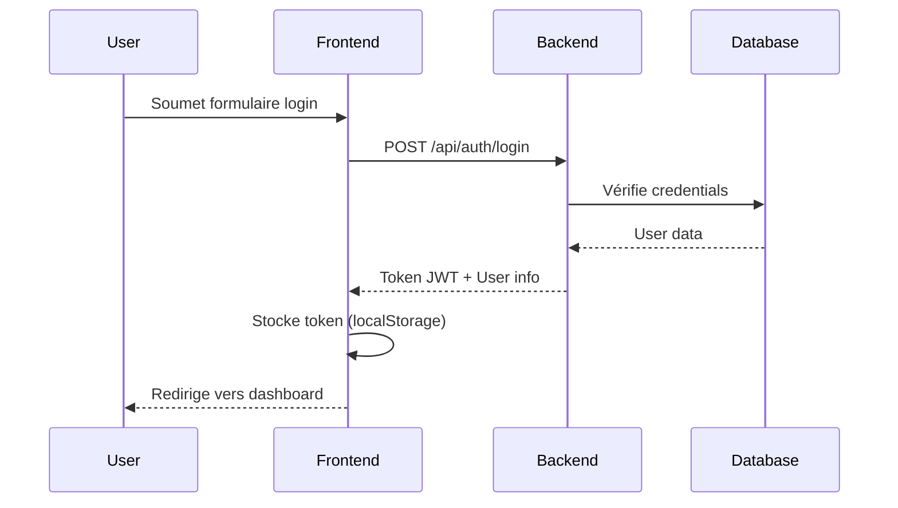
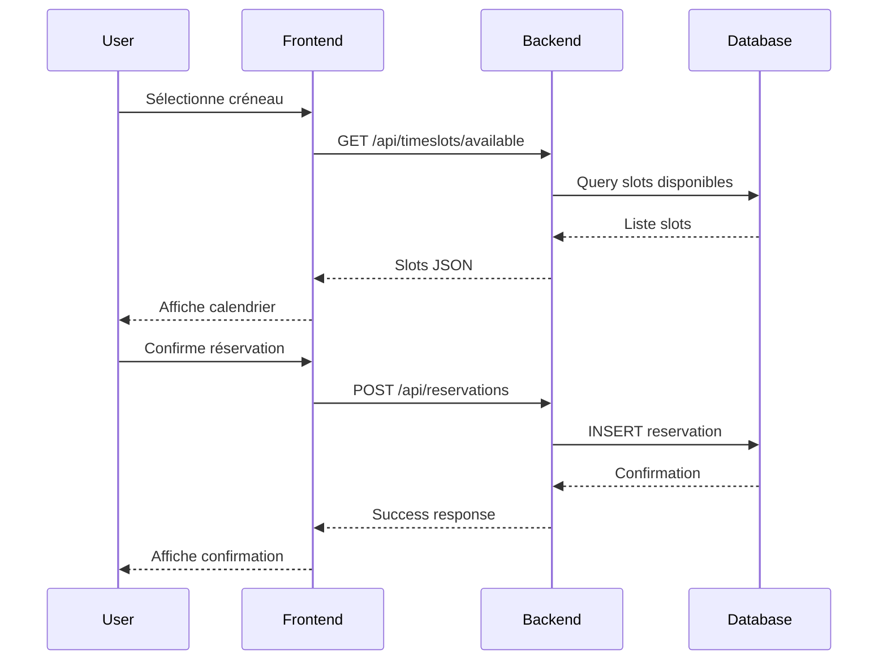

# Architecture - Vue d'ensemble

## Introduction

Le système de réservation est une application web full-stack composée d'un frontend React et d'un backend Flask, avec une base de données MySQL.

## Schéma global

```mermaid
graph TB
    subgraph "Client"
        A[Navigateur Web]
    end

    subgraph "Frontend"
        B[React App<br/>Port 5173]
        C[Vite Dev Server]
    end

    subgraph "Backend"
        D[Flask API<br/>Port 5000]
        E[Routes & Controllers]
    end

    subgraph "Data"
        F[(MySQL<br/>Database)]
        G[Docker Container]
    end

    A -->|HTTP| B
    B -->|API Calls| D
    D -->|SQL| F
    G -.->|Contains| F

    style A fill:#e1f5ff
    style B fill:#61dafb
    style D fill:#000
    style F fill:#4479a1
```



## Stack technologique

### Frontend

| Technologie | Version | Rôle |
|-------------|---------|------|
| React | 19.2.0 | Framework UI |
| Vite | 7.2.5 | Build tool & dev server |
| React Router | 7.9.6 | Routing |
| Tailwind CSS | 4.1.17 | Framework CSS |
| Heroicons | 2.2.0 | Bibliothèque d'icônes |

### Backend

| Technologie | Version | Rôle |
|-------------|---------|------|
| Flask | 0.2.10 | Framework web Python |
| MySQL | 8.0+ | Base de données |
| Docker | Latest | Conteneurisation |

## Architecture en couches

### 1. Présentation (Frontend)

```text
src/
├── pages/              # Pages de l'application
│   ├── Home.jsx
│   ├── Login.jsx
│   ├── Register_User.jsx
│   ├── Register_Pro.jsx
│   └── dashboard_entreprise/
├── components/         # Composants réutilisables
│   └── Header.jsx
├── Hook/              # Custom hooks
│   └── useForm.jsx
├── assets/            # Images, fichiers statiques
└── App.jsx            # Composant racine
```

### 2. Application (Backend)

```text
Backend/
├── app.py             # Point d'entrée Flask
├── routes/            # Routes API (à créer)
├── models/            # Modèles de données (à créer)
├── services/          # Logique métier (à créer)
└── db/               # Configuration base de données
    └── docker-compose.yml
```

### 3. Données

- **MySQL** pour le stockage persistant
- **Tables principales** :
  - `users` - Utilisateurs (étudiants, entreprises)
  - `companies` - Entreprises partenaires
  - `reservations` - Réservations
  - `timeslots` - Créneaux horaires

## Flux de données

### Authentification



### Création de réservation



## Communication Frontend-Backend

### API REST

Le frontend communique avec le backend via une API REST.

**Base URL** : `http://localhost:5000/api`

**Format** : JSON

**Authentification** : JWT Bearer Token

Exemple de requête :

```javascript
fetch('http://localhost:5000/api/reservations', {
  method: 'GET',
  headers: {
    'Content-Type': 'application/json',
    'Authorization': `Bearer ${token}`
  }
})
```

## Gestion de l'état

### Frontend

- **React Hooks** (useState, useEffect)
- **Custom Hook** `useForm` pour les formulaires
- **Context API** (potentiel) pour l'état global
- **localStorage** pour la persistance du token

### Backend

- **Session-based** (Flask sessions)
- **Stateless API** avec JWT

## Sécurité

### Frontend

- Validation des formulaires
- Sanitization des entrées
- Protection XSS
- HTTPS en production

### Backend

- Hash des mots de passe (bcrypt)
- JWT pour l'authentification
- CORS configuré
- Validation des données
- Protection CSRF
- Rate limiting (à implémenter)

## Performance

### Frontend

- **Code splitting** avec React.lazy
- **Build optimisé** avec Vite
- **CSS purging** avec Tailwind
- **Lazy loading** des images

### Backend

- **Connection pooling** MySQL
- **Caching** (Redis potentiel)
- **Compression** des réponses
- **Pagination** des résultats

## Déploiement

### Environnements

| Env | Frontend | Backend | Database |
|-----|----------|---------|----------|
| Dev | localhost:5173 | localhost:5000 | Docker local |
| Staging | staging.domain.com | api-staging | MySQL staging |
| Prod | www.domain.com | api.domain.com | MySQL prod |

### Infrastructure

```mermaid
graph LR
    A[Users] -->|HTTPS| B[CDN/CloudFlare]
    B --> C[Nginx]
    C -->|Static Files| D[React App]
    C -->|/api/*| E[Flask App]
    E --> F[(MySQL)]

    style A fill:#e1f5ff
    style B fill:#fbbf24
    style C fill:#10b981
    style D fill:#61dafb
    style E fill:#000
    style F fill:#4479a1
```



## Scalabilité

### Horizontal scaling

- Multiple instances de Flask derrière un load balancer
- CDN pour les assets statiques
- Database replication (master-slave)

### Vertical scaling

- Augmentation des ressources serveur
- Optimisation des requêtes SQL
- Caching agressif

## Monitoring

- **Frontend** : Google Analytics, Sentry
- **Backend** : Logs Flask, APM
- **Database** : MySQL slow query log
- **Infrastructure** : Uptime monitoring

## Prochaines étapes

- [Architecture Frontend](frontend.md) - Détails React
- [Architecture Backend](backend.md) - Détails Flask
- [Base de données](database.md) - Schéma SQL
