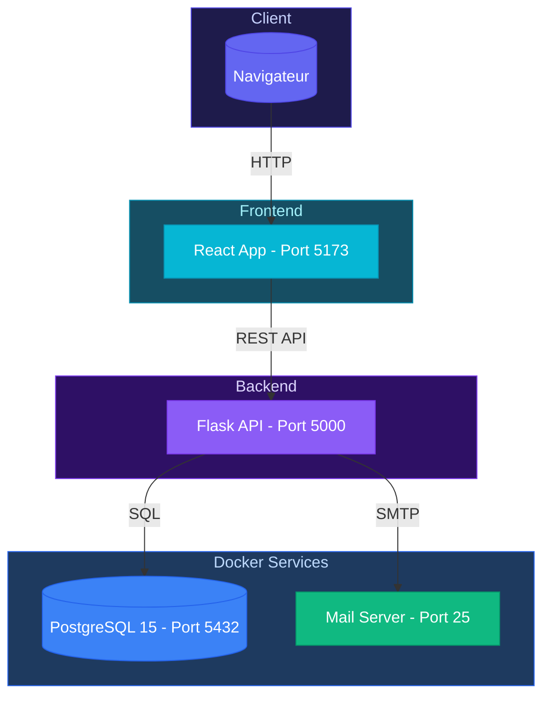

# Architecture - Vue d'ensemble

**Projet GitHub :** [https://github.com/TISEPSE/Book-By-Click.git](https://github.com/TISEPSE/Book-By-Click.git)

## Schéma global



## Stack technologique

### Frontend

| Technologie | Version | Rôle |
|-------------|---------|------|
| React | 19.2.0 | Framework UI |
| Vite | 7.2.5 (rolldown) | Build tool |
| React Router | 7.10.1 | Routing |
| Tailwind CSS | 4.1.17 | Styling |
| Recharts | 3.5.1 | Graphiques |
| date-fns | 4.1.0 | Dates |

### Backend

| Technologie | Version | Rôle |
|-------------|---------|------|
| Flask | Latest | Framework web |
| SQLAlchemy | Latest | ORM |
| PostgreSQL | 15 | Base de données |
| Docker Compose | Latest | Orchestration |

## Architecture en couches

### 1. Présentation (Frontend)

```text
src/
├── pages/              # Pages de l'application
│   ├── Home.jsx
│   ├── Login.jsx
│   ├── Register_User.jsx
│   ├── Register_Pro.jsx
│   └── dashboard_entreprise/
├── components/         # Composants réutilisables
│   └── Header.jsx
├── Hook/              # Custom hooks
│   └── useForm.jsx
├── assets/            # Images, fichiers statiques
└── App.jsx            # Composant racine
```

### 2. Application (Backend)

```text
Backend/
├── app.py             # Point d'entrée Flask
├── routes/            # Routes API (à créer)
├── models/            # Modèles de données (à créer)
├── services/          # Logique métier (à créer)
└── db/               # Configuration base de données
    └── docker-compose.yml
```

### 3. Données

**PostgreSQL 15** avec 9 tables :

- `typeutilisateur` - Types d'utilisateurs
- `utilisateur` - Utilisateurs (clients et pros)
- `entreprise` - Entreprises
- `prestation` - Services offerts
- `creneau` - Créneaux horaires
- `reservation` - Réservations
- `evenement` - Événements
- `semainetype` - Semaines types
- `eventemail` - Événements email

## Communication Frontend-Backend

**API REST** : `http://localhost:5000`

**Format** : JSON et form-data selon les endpoints

**6 endpoints disponibles** :
- POST `/register_form` - Inscription
- POST `/login_form` - Connexion
- POST `/teste` - Récupérer utilisateur
- POST `/contact` - Formulaire contact
- GET `/api/services` - Autocomplétion services
- GET `/api/villes` - Autocomplétion villes

Voir la [documentation API](../api/endpoints.md) complète.

## Gestion de l'état

**Frontend :**
- React Hooks (useState, useEffect)
- Custom Hook useCalendar pour le calendrier
- État local des composants

**Backend :**
- SQLAlchemy ORM
- Factory pattern (`create_app()`)
- Single blueprint architecture

## Services Docker

**PostgreSQL** (port 5432) :
- Image: postgres:15
- User: appuser
- Database: appdb

**SMTP** (port 25) :
- Relay: smtp.gmail.com:587
- Configuration dans `Backend/src/docker-compose.yml`

## Environnements

| Env | Frontend | Backend | Database |
|-----|----------|---------|----------|
| Dev | localhost:5173 | localhost:5000 | Docker PostgreSQL |
| Prod | Serveur web | Flask + Nginx | PostgreSQL |

## Prochaines étapes

- [Architecture Frontend](frontend.md) - Détails React
- [Architecture Backend](backend.md) - Détails Flask
- [Base de données](database.md) - Schéma SQL
