# Guide de déploiement

Guide de déploiement de Book By Click en production.

**Projet GitHub :** [https://github.com/TISEPSE/Book-By-Click.git](https://github.com/TISEPSE/Book-By-Click.git)

## Vue d'ensemble

```mermaid
graph TB
    A[Code Source] --> B[Build Frontend]
    A --> C[Backend Flask]
    B --> D[Serveur Web]
    C --> D
    D --> F[Internet]
    G[(PostgreSQL)] --> C
    H[SMTP] --> C

    style A fill:#61dafb
    style D fill:#10b981
    style C fill:#000
    style G fill:#4479a1
```



## Prérequis

### Serveur

- **OS:** Ubuntu 20.04+ ou Debian 11+
- **RAM:** 2 GB minimum
- **CPU:** 2 cores minimum
- **Stockage:** 20 GB minimum

### Services

- Docker (pour PostgreSQL et SMTP)
- Nginx
- Python 3.8+
- Node.js 18+

## Installation

### 1. Mise à jour et dépendances

```bash
sudo apt update && sudo apt upgrade -y
sudo apt install python3 python3-pip python3-venv nginx git docker.io docker-compose -y

# Node.js 18
curl -fsSL https://deb.nodesource.com/setup_18.x | sudo -E bash -
sudo apt install nodejs -y
```

### 2. Pare-feu

```bash
sudo ufw allow OpenSSH
sudo ufw allow 'Nginx Full'
sudo ufw enable
```

## Déploiement

### 1. Cloner le projet

```bash
cd /opt
sudo git clone https://github.com/TISEPSE/Book-By-Click.git
cd Book-By-Click
```

### 2. Backend

```bash
# Python
python3 -m venv venv
source venv/bin/activate
pip install flask flask-sqlalchemy flask-cors psycopg2-binary python-dotenv

# Lancer PostgreSQL et SMTP avec Docker
cd Backend/src
docker compose up -d
```

### 3. Frontend

```bash
# Build
npm install
npm run build

# Déployer
sudo cp -r dist/* /var/www/html/
```

### 4. Service systemd pour Flask

```bash
sudo nano /etc/systemd/system/bookbyclick.service
```

```ini
[Unit]
Description=Book By Click API
After=network.target docker.service

[Service]
WorkingDirectory=/opt/Book-By-Click/Backend/src
Environment="PATH=/opt/Book-By-Click/venv/bin"
ExecStart=/opt/Book-By-Click/venv/bin/python -m flask --app app run --host=0.0.0.0 --port=5000

Restart=always

[Install]
WantedBy=multi-user.target
```

```bash
sudo systemctl daemon-reload
sudo systemctl enable bookbyclick
sudo systemctl start bookbyclick
```

## Configuration Nginx

```bash
sudo nano /etc/nginx/sites-available/default
```

```nginx
server {
    listen 80;
    server_name _;

    # Frontend
    location / {
        root /var/www/html;
        try_files $uri $uri/ /index.html;
    }

    # API
    location /api/ {
        proxy_pass http://localhost:5000/;
        proxy_set_header Host $host;
        proxy_set_header X-Real-IP $remote_addr;
    }
}
```

```bash
sudo nginx -t
sudo systemctl reload nginx
```

## SSL avec Let's Encrypt (optionnel)

```bash
sudo apt install certbot python3-certbot-nginx -y
sudo certbot --nginx -d votredomaine.com
```

## Maintenance

### Logs

```bash
# API
sudo journalctl -u bookbyclick -f

# Base de données
docker logs db

# Nginx
sudo tail -f /var/log/nginx/error.log
```

### Mise à jour

```bash
cd /opt/Book-By-Click
sudo git pull
npm run build
sudo cp -r dist/* /var/www/html/
sudo systemctl restart bookbyclick
```

### Sauvegarde PostgreSQL

```bash
docker exec db pg_dump -U appuser appdb > backup_$(date +%Y%m%d).sql
```
