# Guide de déploiement

Ce guide détaille les étapes pour déployer Book By Click en production.

## Vue d'ensemble

```mermaid
graph TB
    A[Code Source] --> B[Build Frontend]
    A --> C[Backend Flask]
    B --> D[Serveur Web Nginx]
    C --> E[Gunicorn WSGI]
    E --> D
    D --> F[Internet]
    G[(MySQL)] --> C

    style A fill:#61dafb
    style D fill:#10b981
    style E fill:#000
    style G fill:#4479a1
```



## Prérequis

### Serveur

- **OS:** Ubuntu 20.04 LTS ou supérieur (recommandé)
- **RAM:** Minimum 2 GB, recommandé 4 GB
- **CPU:** 2 cores minimum
- **Stockage:** 20 GB minimum
- **Accès:** Root ou sudo

### Noms de domaine

- Domaine principal: `example.com` ou `www.example.com`
- Sous-domaine API: `api.example.com`

### Services requis

- MySQL 8.0+
- Nginx
- Python 3.8+
- Node.js 18+

---

## Préparation du serveur

### 1. Mise à jour du système

```bash
sudo apt update && sudo apt upgrade -y
```

### 2. Installation des dépendances

```bash
# Python et pip
sudo apt install python3 python3-pip python3-venv -y

# Node.js et npm
curl -fsSL https://deb.nodesource.com/setup_18.x | sudo -E bash -
sudo apt install nodejs -y

# Nginx
sudo apt install nginx -y

# MySQL
sudo apt install mysql-server -y

# Outils de build
sudo apt install build-essential git -y
```

### 3. Configuration du pare-feu

```bash
# Autoriser SSH, HTTP, HTTPS
sudo ufw allow OpenSSH
sudo ufw allow 'Nginx Full'
sudo ufw enable
```

### 4. Sécurisation MySQL

```bash
sudo mysql_secure_installation
```

Suivez les instructions:
- Définir un mot de passe root
- Supprimer les utilisateurs anonymes
- Désactiver la connexion root à distance
- Supprimer la base de test

---

## Configuration de la base de données

### 1. Créer la base de données

```bash
sudo mysql -u root -p
```

```sql
-- Créer la base de données
CREATE DATABASE reservations_db CHARACTER SET utf8mb4 COLLATE utf8mb4_unicode_ci;

-- Créer l'utilisateur
CREATE USER 'reserv_user'@'localhost' IDENTIFIED BY 'MOT_DE_PASSE_SECURISE';

-- Donner les permissions
GRANT ALL PRIVILEGES ON reservations_db.* TO 'reserv_user'@'localhost';
FLUSH PRIVILEGES;

-- Vérifier
SHOW DATABASES;
SELECT User, Host FROM mysql.user;

EXIT;
```

### 2. Importer le schéma

```bash
# Depuis votre machine locale
scp database_schema.sql user@server:/tmp/

# Sur le serveur
mysql -u reserv_user -p reservations_db < /tmp/database_schema.sql
```

---

## Déploiement du Backend

### 1. Créer un utilisateur dédié

```bash
sudo useradd -m -s /bin/bash bookbyclick
sudo su - bookbyclick
```

### 2. Cloner le projet

```bash
cd /home/bookbyclick
git clone https://github.com/TISEPSE/Book-By-Click.git
cd Book-By-Click
```

### 3. Configuration Python

```bash
# Créer l'environnement virtuel
python3 -m venv venv
source venv/bin/activate

# Installer les dépendances
cd Backend
pip install flask flask-cors mysql-connector-python python-dotenv gunicorn PyJWT werkzeug
```

### 4. Variables d'environnement

```bash
nano /home/bookbyclick/Book-By-Click/Backend/.env
```

Contenu:

```env
FLASK_APP=app.py
FLASK_ENV=production
SECRET_KEY=GENERER_UNE_CLE_SECRETE_LONGUE_ET_ALEATOIRE

DATABASE_HOST=localhost
DATABASE_USER=reserv_user
DATABASE_PASSWORD=MOT_DE_PASSE_SECURISE
DATABASE_NAME=reservations_db

JWT_SECRET_KEY=GENERER_UNE_AUTRE_CLE_SECRETE

# Email (optionnel)
MAIL_SERVER=smtp.gmail.com
MAIL_PORT=587
MAIL_USERNAME=your-email@gmail.com
MAIL_PASSWORD=app-password

# Frontend URL
FRONTEND_URL=https://www.example.com
```

!!! warning "Sécurité"
    Générez des clés secrètes fortes:
    ```bash
    python3 -c "import secrets; print(secrets.token_hex(32))"
    ```

### 5. Tester le backend

```bash
source /home/bookbyclick/Book-By-Click/venv/bin/activate
cd /home/bookbyclick/Book-By-Click/Backend
gunicorn -w 2 -b 127.0.0.1:5000 app:app
```

Testez dans un autre terminal:
```bash
curl http://127.0.0.1:5000/api/health
```

### 6. Créer un service systemd

Sortir de l'utilisateur bookbyclick:
```bash
exit  # Retour à l'utilisateur sudo
```

```bash
sudo nano /etc/systemd/system/bookbyclick-api.service
```

Contenu:

```ini
[Unit]
Description=Book By Click API
After=network.target mysql.service

[Service]
User=bookbyclick
Group=bookbyclick
WorkingDirectory=/home/bookbyclick/Book-By-Click/Backend
Environment="PATH=/home/bookbyclick/Book-By-Click/venv/bin"
ExecStart=/home/bookbyclick/Book-By-Click/venv/bin/gunicorn \
    --workers 4 \
    --bind 127.0.0.1:5000 \
    --timeout 120 \
    --access-logfile /var/log/bookbyclick/access.log \
    --error-logfile /var/log/bookbyclick/error.log \
    app:app

Restart=always
RestartSec=10

[Install]
WantedBy=multi-user.target
```

### 7. Créer le dossier de logs

```bash
sudo mkdir -p /var/log/bookbyclick
sudo chown bookbyclick:bookbyclick /var/log/bookbyclick
```

### 8. Démarrer le service

```bash
sudo systemctl daemon-reload
sudo systemctl start bookbyclick-api
sudo systemctl enable bookbyclick-api
sudo systemctl status bookbyclick-api
```

---

## Déploiement du Frontend

### 1. Build du frontend

Sur votre machine locale:

```bash
cd Book-By-Click
npm install
npm run build
```

### 2. Transférer les fichiers

```bash
# Créer une archive
tar -czf dist.tar.gz dist/

# Transférer vers le serveur
scp dist.tar.gz user@server:/tmp/
```

### 3. Déployer sur le serveur

```bash
# Sur le serveur
sudo mkdir -p /var/www/bookbyclick
cd /var/www/bookbyclick
sudo tar -xzf /tmp/dist.tar.gz
sudo mv dist/* .
sudo rmdir dist
sudo chown -R www-data:www-data /var/www/bookbyclick
```

---

## Configuration Nginx

### 1. Configuration du site

```bash
sudo nano /etc/nginx/sites-available/bookbyclick
```

Contenu:

```nginx
# Redirection HTTP vers HTTPS
server {
    listen 80;
    listen [::]:80;
    server_name example.com www.example.com api.example.com;
    return 301 https://$server_name$request_uri;
}

# Frontend - www.example.com
server {
    listen 443 ssl http2;
    listen [::]:443 ssl http2;
    server_name www.example.com example.com;

    # Certificats SSL (voir section SSL)
    ssl_certificate /etc/letsencrypt/live/example.com/fullchain.pem;
    ssl_certificate_key /etc/letsencrypt/live/example.com/privkey.pem;

    # Configuration SSL recommandée
    ssl_protocols TLSv1.2 TLSv1.3;
    ssl_ciphers HIGH:!aNULL:!MD5;
    ssl_prefer_server_ciphers on;

    # Headers de sécurité
    add_header X-Frame-Options "SAMEORIGIN" always;
    add_header X-Content-Type-Options "nosniff" always;
    add_header X-XSS-Protection "1; mode=block" always;
    add_header Strict-Transport-Security "max-age=31536000; includeSubDomains" always;

    root /var/www/bookbyclick;
    index index.html;

    # Compression
    gzip on;
    gzip_vary on;
    gzip_min_length 1024;
    gzip_types text/plain text/css text/xml text/javascript application/json application/javascript application/xml+rss;

    location / {
        try_files $uri $uri/ /index.html;
    }

    # Cache des assets statiques
    location ~* \.(jpg|jpeg|png|gif|ico|css|js|svg|woff|woff2|ttf|eot)$ {
        expires 1y;
        add_header Cache-Control "public, immutable";
    }

    # Logs
    access_log /var/log/nginx/bookbyclick-access.log;
    error_log /var/log/nginx/bookbyclick-error.log;
}

# Backend API - api.example.com
server {
    listen 443 ssl http2;
    listen [::]:443 ssl http2;
    server_name api.example.com;

    ssl_certificate /etc/letsencrypt/live/api.example.com/fullchain.pem;
    ssl_certificate_key /etc/letsencrypt/live/api.example.com/privkey.pem;

    ssl_protocols TLSv1.2 TLSv1.3;
    ssl_ciphers HIGH:!aNULL:!MD5;
    ssl_prefer_server_ciphers on;

    # Rate limiting
    limit_req_zone $binary_remote_addr zone=api_limit:10m rate=10r/s;
    limit_req zone=api_limit burst=20 nodelay;

    location / {
        proxy_pass http://127.0.0.1:5000;
        proxy_set_header Host $host;
        proxy_set_header X-Real-IP $remote_addr;
        proxy_set_header X-Forwarded-For $proxy_add_x_forwarded_for;
        proxy_set_header X-Forwarded-Proto $scheme;

        # CORS (si nécessaire)
        add_header Access-Control-Allow-Origin "https://www.example.com" always;
        add_header Access-Control-Allow-Methods "GET, POST, PUT, DELETE, OPTIONS" always;
        add_header Access-Control-Allow-Headers "Authorization, Content-Type" always;

        if ($request_method = 'OPTIONS') {
            return 204;
        }

        # Timeouts
        proxy_connect_timeout 60s;
        proxy_send_timeout 60s;
        proxy_read_timeout 60s;
    }

    access_log /var/log/nginx/bookbyclick-api-access.log;
    error_log /var/log/nginx/bookbyclick-api-error.log;
}
```

### 2. Activer le site

```bash
sudo ln -s /etc/nginx/sites-available/bookbyclick /etc/nginx/sites-enabled/
sudo nginx -t
sudo systemctl restart nginx
```

---

## Configuration SSL (HTTPS)

### 1. Installer Certbot

```bash
sudo apt install certbot python3-certbot-nginx -y
```

### 2. Obtenir les certificats

```bash
# Pour le frontend
sudo certbot --nginx -d example.com -d www.example.com

# Pour l'API
sudo certbot --nginx -d api.example.com
```

### 3. Renouvellement automatique

```bash
# Tester le renouvellement
sudo certbot renew --dry-run

# Le cron est automatiquement créé
sudo systemctl status certbot.timer
```

---

## Monitoring et maintenance

### 1. Logs

```bash
# Logs de l'API
sudo tail -f /var/log/bookbyclick/error.log

# Logs Nginx
sudo tail -f /var/log/nginx/bookbyclick-error.log

# Logs système
sudo journalctl -u bookbyclick-api -f
```

### 2. Monitoring de l'API

```bash
# Vérifier le statut
sudo systemctl status bookbyclick-api

# Redémarrer si nécessaire
sudo systemctl restart bookbyclick-api
```

### 3. Sauvegarde automatique de la base de données

```bash
sudo nano /home/bookbyclick/backup-db.sh
```

```bash
#!/bin/bash
DATE=$(date +%Y-%m-%d_%H-%M-%S)
BACKUP_DIR="/home/bookbyclick/backups"
mkdir -p $BACKUP_DIR

mysqldump -u reserv_user -pMOT_DE_PASSE reservations_db \
  | gzip > $BACKUP_DIR/db_backup_$DATE.sql.gz

# Garder seulement les 7 derniers jours
find $BACKUP_DIR -name "db_backup_*.sql.gz" -mtime +7 -delete
```

```bash
chmod +x /home/bookbyclick/backup-db.sh

# Ajouter au crontab (tous les jours à 2h du matin)
sudo crontab -e
```

Ajouter:
```
0 2 * * * /home/bookbyclick/backup-db.sh
```

---

## Mise à jour de l'application

### Backend

```bash
sudo su - bookbyclick
cd /home/bookbyclick/Book-By-Click
git pull origin main

source venv/bin/activate
pip install -r Backend/requirements.txt

exit  # Retour à l'utilisateur sudo
sudo systemctl restart bookbyclick-api
```

### Frontend

```bash
# Sur votre machine locale
npm run build
scp -r dist/* user@server:/tmp/frontend-new/

# Sur le serveur
sudo rm -rf /var/www/bookbyclick/*
sudo mv /tmp/frontend-new/* /var/www/bookbyclick/
sudo chown -R www-data:www-data /var/www/bookbyclick
```

---

## Sécurité additionnelle

### 1. Fail2ban pour protéger contre les attaques

```bash
sudo apt install fail2ban -y
sudo nano /etc/fail2ban/jail.local
```

```ini
[nginx-http-auth]
enabled = true

[nginx-noscript]
enabled = true

[nginx-badbots]
enabled = true
```

```bash
sudo systemctl restart fail2ban
```

### 2. Rate limiting dans l'API

Dans votre code Flask, ajoutez Flask-Limiter:

```python
from flask_limiter import Limiter

limiter = Limiter(
    app,
    key_func=lambda: request.headers.get('X-Real-IP', request.remote_addr),
    default_limits=["200 per hour"]
)

@app.route('/api/auth/login', methods=['POST'])
@limiter.limit("5 per minute")
def login():
    # ...
```

---

## Troubleshooting

### L'API ne répond pas

```bash
# Vérifier le service
sudo systemctl status bookbyclick-api

# Voir les logs
sudo journalctl -u bookbyclick-api --since "10 minutes ago"

# Redémarrer
sudo systemctl restart bookbyclick-api
```

### Erreur 502 Bad Gateway

```bash
# Vérifier que Gunicorn écoute sur le bon port
sudo netstat -tulpn | grep 5000

# Vérifier les permissions
ls -la /home/bookbyclick/Book-By-Click/

# Vérifier la configuration Nginx
sudo nginx -t
```

### Base de données inaccessible

```bash
# Vérifier MySQL
sudo systemctl status mysql

# Tester la connexion
mysql -u reserv_user -p reservations_db

# Vérifier les permissions
mysql -u root -p -e "SHOW GRANTS FOR 'reserv_user'@'localhost';"
```

---

## Checklist de déploiement

- [ ] Serveur mis à jour et sécurisé
- [ ] MySQL installé et configuré
- [ ] Base de données créée avec le schéma
- [ ] Backend déployé et service systemd actif
- [ ] Frontend build et déployé
- [ ] Nginx configuré avec SSL
- [ ] Certificats SSL installés
- [ ] DNS configurés correctement
- [ ] Sauvegardes automatiques configurées
- [ ] Monitoring en place
- [ ] Rate limiting activé
- [ ] Variables d'environnement sécurisées
- [ ] Logs fonctionnels
- [ ] Tests de l'application en production

---

## Ressources

- [Documentation Nginx](https://nginx.org/en/docs/)
- [Guide Gunicorn](https://docs.gunicorn.org/)
- [Let's Encrypt](https://letsencrypt.org/)
- [Architecture du projet](architecture/overview.md)
