# Système de Réservation

Bienvenue dans la documentation du **Système de Réservation** pour entreprises et établissements scolaires.

## Vue d'ensemble

Cette application permet aux étudiants de prendre rendez-vous avec des entreprises partenaires pour des entretiens, stages ou opportunités professionnelles.

### Technologies

=== "Frontend"
    - **React 19** - Framework JavaScript
    - **Vite** - Build tool moderne
    - **Tailwind CSS 4** - Framework CSS
    - **React Router 7** - Gestion des routes

=== "Backend"
    - **Flask** - Framework Python
    - **MySQL** - Base de données
    - **Docker** - Conteneurisation

## Fonctionnalités principales

!!! success "Pour les étudiants"
    - Création de compte
    - Navigation des entreprises partenaires
    - Réservation de créneaux horaires
    - Gestion des rendez-vous
    - Notifications

!!! info "Pour les entreprises"
    - Dashboard de gestion
    - Calendrier des réservations
    - Gestion des clients
    - Statistiques
    - Configuration des disponibilités

## Architecture

```mermaid
graph TB
    A[Client React] -->|HTTPS| B[Backend Flask]
    B -->|SQL| C[(MySQL Database)]
    D[Docker] -.->|Container| C

    style A fill:#61dafb
    style B fill:#000
    style C fill:#4479a1
    style D fill:#2496ed
```



## Démarrage rapide

### Prérequis

- Node.js 18+
- Python 3.8+
- Docker (optionnel pour la base de données)

### Installation

```bash
# Cloner le projet
git clone <repository>
cd Projet-BTS-Alan-Maxime-Tisba

# Installer les dépendances frontend
npm install

# Installer les dépendances backend
cd Backend
python -m venv ../venv
source ../venv/bin/activate  # Linux/Mac
# ou ../venv/Scripts/activate  # Windows
pip install -r requirements.txt
```

### Lancement

=== "Linux/Mac"
    ```bash
    npm run dev:lin
    ```

=== "Windows"
    ```bash
    npm run dev:win
    ```

=== "Avec Docker"
    ```bash
    npm run dev:all
    ```

L'application sera accessible sur :

- **Frontend** : http://localhost:5173
- **Backend** : http://localhost:5000

## Structure de la documentation

| Section | Description |
|---------|-------------|
| [Installation](installation.md) | Guide d'installation détaillé |
| [Architecture](architecture/overview.md) | Architecture technique du système |
| [API](api/endpoints.md) | Référence des endpoints API |
| [Développement](development/getting-started.md) | Documentation pour développeurs |
| [Déploiement](deployment.md) | Guide de déploiement en production |

## Support

Pour toute question ou problème :

- Consultez la documentation
- Ouvrez une issue sur GitHub
- Contactez l'équipe de développement

---

*Documentation générée avec MkDocs Material*
