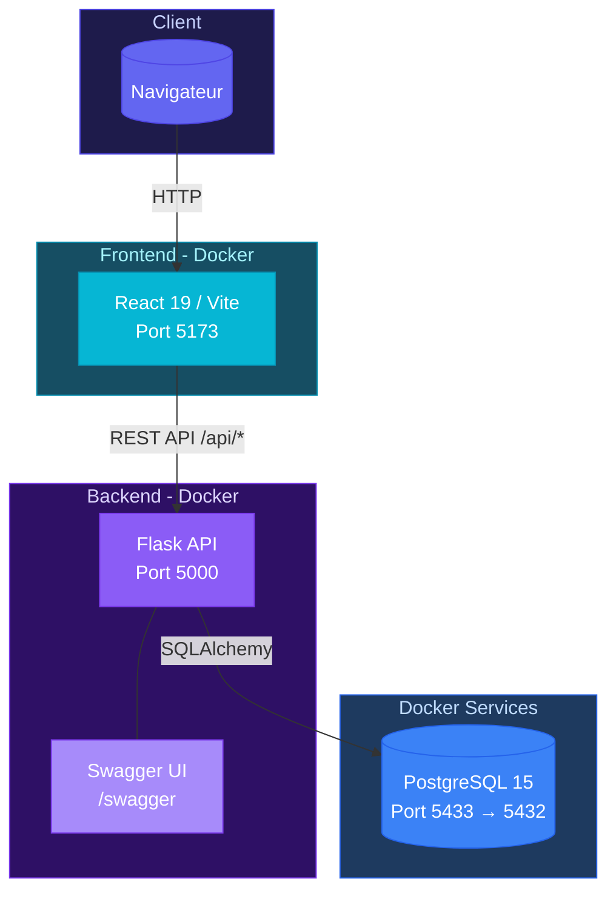

# Architecture - Book-By-Click

## Schema Global

## Stack

**Frontend:** React 19, Vite (rolldown), React Router 7, TailwindCSS 4, Styled Components, Recharts, react-big-calendar, Lucide Icons, Heroicons

**Backend:** Flask, Flask-SQLAlchemy, Flask-CORS, Flask-Swagger-UI, python-dotenv

**Database:** PostgreSQL 15

**Services Docker:** PostgreSQL (5433), Backend Flask (5000), Frontend Vite (5173)

## Communication

API REST en JSON sur `http://localhost:5000/api/*`
