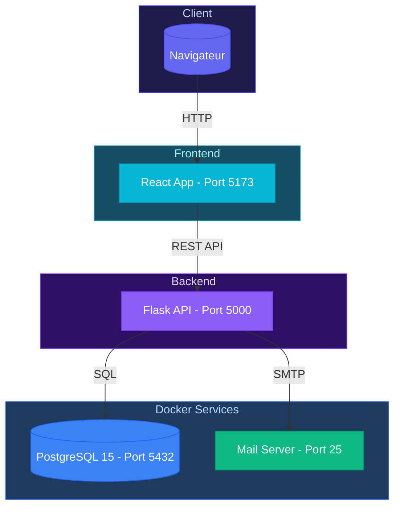

# Architecture - Book-By-Click

## Schema Global

## Stack

**Frontend:** React 19, Vite, React Router, TailwindCSS, Recharts

**Backend:** Flask, SQLAlchemy, Flask-CORS

**Database:** PostgreSQL 15

**Services Docker:** PostgreSQL (5432), Mail Server (25)

## Communication

API REST en JSON sur `http://localhost:5000`
